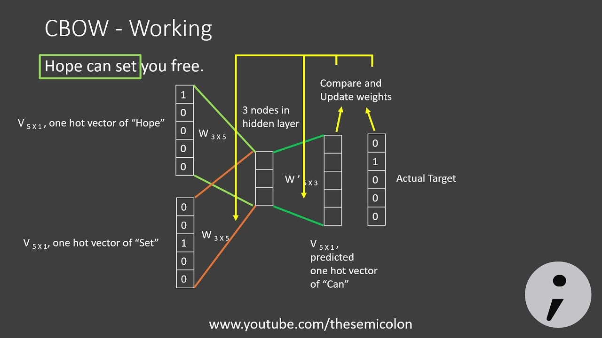

# Word-Embeddings

This GitHub repository contains implementations of three popular word embedding techniques: Singular Value Decomposition (SVD), Continuous Bag of Words (CBOW), and Embeddings from Language Models (ELMO). Word embeddings are a fundamental component of natural language processing and are essential for various text-based machine learning tasks.

## 1. Introduction

Word embeddings are vector representations of words in a continuous vector space. They capture semantic and syntactic relationships between words and are widely used in tasks such as sentiment analysis, machine translation, and information retrieval. In this repository, we provide implementations of three distinct word embedding techniques, each with its own approach to generating these vector representations.

## 2. Singular Value Decomposition (SVD)

Singular Value Decomposition (SVD) is a dimensionality reduction technique that can be used to create word embeddings. In this method, a term-document matrix is factorized to find the **Co-occurance matrix** that represent words and documents in lower-dimensional spaces. SVD has been a foundational technique for natural language processing tasks and is known for its simplicity and interpretability.

Our implementation of SVD word embeddings demonstrates how to perform this factorization on a given text corpus and obtain word vectors that capture the underlying semantic structure of words.

## 3. Continuous Bag of Words (CBOW)

Continuous Bag of Words (CBOW) is a neural network-based word embedding method. It is part of the Word2Vec family of algorithms. In CBOW, a neural network is trained to predict a target word based on its surrounding context words. The weights of this network are used as word vectors. CBOW is known for its ability to capture context-based semantics and is computationally efficient.

This repository includes an implementation of CBOW for generating word embeddings. We demonstrate how to train a CBOW model on a given text corpus and utilize the trained model to extract word vectors.

## 4. Embeddings from Language Models (ELMO)

Embeddings from Language Models (ELMO) is a contextual word embedding technique that utilizes pre-trained language models. ELMO generates word embeddings by considering the context in which a word appears within a sentence. This contextual information allows ELMO to capture word sense disambiguation and context-dependent word meanings.

In this repository, we provide an implementation of ELMO that uses a pre-trained language model to obtain word embeddings for your text data.

## Contributions

Contributions to this project are welcome! If you find any issues or have ideas for improvements, please feel free to open an issue or submit a pull request.

If you have any questions or encounter issues, please don't hesitate to open an issue in this repository. We welcome contributions and feedback to improve these word embedding implementations. Happy embedding!

Let's make this better together!!
